# claude-workflow

Workflow skills plugin for Claude Code — a standardized lifecycle for feature development.

```mermaid
%%{init: {'theme':'base', 'themeVariables': {'background':'#000','primaryColor':'#ffffff','primaryTextColor':'#000000','primaryBorderColor':'#000000','lineColor':'#000000','textColor':'#000000','titleColor':'#000000','clusterBkg':'#f3f4f6','clusterBorder':'#000000','edgeLabelBackground':'#ffffff','edgeLabelBackground':'#ffffff'}}}%%
flowchart TB
    subgraph Canvas["Skills flowchart"]
        direction TB
        Start([feature request]) --> Discovery

        subgraph Discovery["/discovery — explore & scope"]
            direction LR
            D_Describe["/describe — problem space"]
            D_Specify["/specify — acceptance criteria"]
            D_Scout["Prior-Art Scout"]
            D_Scout -.seed brief.-> D_Describe
        end

        subgraph Define["/define — solution architecture"]
            direction LR
            Df_Arch["/architecture — tech decisions"]
            Df_Design["/design — UX/UI"]
        end

        subgraph Implement["/implement — build loop"]
            direction LR
            I_Build["/build — TDD"]
            I_Review["/review — correctness + standards"]
            I_Verify["/verify — AC QA"]
            I_Build --> I_Review --> I_Verify
            I_Verify -.fix brief.-> I_Build
            I_Review -.fix brief.-> I_Build
        end

        Discovery -->|create issue body| Define
        Define -->|issue body| Implement
        Implement --> PR([draft PR])
        PR --> WrapUp["/wrap-up — harvest NOTES.md"]
        PR --> Compound["/compound — capture learnings"]
        PR --> ResolvePR["/resolve-pr-feedback — batch review responses"]

        subgraph Meta["Other tools"]
            direction LR
            NewSkill["/new-skill"]
            FindSkills["/find-skills"]
            Prune["/prune — audit memory"]
            GrillMe["/grill-me"]
        end

        GrillMe -.-> D_Describe
        GrillMe -.-> D_Specify
        GrillMe -.-> Df_Arch
        GrillMe -.-> Df_Design
        GrillMe -.-> NewSkill

        subgraph Obsidian["claude-obsidian (optional)"]
            direction LR
            Save["/save"]
            WikiQuery["wiki-query"]
            WikiLint["wiki-lint"]
        end
        Compound -. filing .-> Save
        Df_Arch -. prior patterns .-> WikiQuery
        Define -. prior decisions .-> WikiQuery
        Prune -. vault audit .-> WikiLint
    end

    classDef canvas fill:#ffffff,stroke:#ffffff,color:#000000
    classDef orch fill:#dddddd,stroke:#000000,stroke-width:2px,color:#000000
    classDef spec fill:#eeeeee,stroke:#000000,stroke-width:2px,color:#000000
    classDef prim fill:#a5b4fc,stroke:#000000,stroke-width:2px,color:#000000
    classDef meta fill:#d1d5db,stroke:#000000,stroke-width:2px,color:#000000
    classDef ext  fill:#f9a8d4,stroke:#000000,stroke-width:2px,stroke-dasharray:4 2,color:#000000
    class Canvas canvas
    class Discovery,Define,Implement orch
    class D_Describe,D_Specify,D_Scout,Df_Arch,Df_Design,I_Build,I_Review,I_Verify spec
    class GrillMe,NewSkill,FindSkills,Prune,WrapUp,Compound,ResolvePR,Save,WikiQuery,WikiLint meta
    class Obsidian ext
```



**Legend**: orchestrators (amber) spawn specialists (blue); `/grill-me` (indigo) is a reusable primitive; plugin-level tools (gray) run outside the phase lifecycle; claude-obsidian integrations (dashed pink) activate when that plugin is installed.

## Install

This repo is its own marketplace — the plugin and marketplace manifests both live in `.claude-plugin/`, so a single `marketplace add` points Claude Code at both.

```bash
claude plugin marketplace add misiekhardcore/claude-workflow
claude plugin install claude-workflow@claude-workflow
```

Then enable it in your project or globally in Claude Code settings.

## Prerequisites

Skills that spawn parallel sub-agents (`/discovery`, `/define`, `/implement`, and others that use `TeamCreate`) require:

```bash
export CLAUDE_CODE_EXPERIMENTAL_AGENT_TEAMS=1
```

Without this flag, `TeamCreate` is unavailable. Skills detect its absence and fall back to sequential execution, noting the degraded mode explicitly.

## Skills

| Skill                  | Description                                                                                                      |
| ---------------------- | ---------------------------------------------------------------------------------------------------------------- |
| `/discovery`           | Explore a problem and produce a GitHub issue with acceptance criteria                                            |
| `/define`              | Plan architecture and design; produces the implementation handoff                                                |
| `/implement`           | Full build→review→verify cycle, ends with a draft PR                                                             |
| `/build`               | Code against an issue's acceptance criteria using TDD                                                            |
| `/review`              | Review an implementation; correctness, standards, and conditional specialists                                    |
| `/verify`              | QA verification of every acceptance criterion                                                                    |
| `/describe`            | Explore and understand a problem space interactively                                                             |
| `/specify`             | Turn a problem statement into testable acceptance criteria                                                       |
| `/architecture`        | Decide on technical architecture — components, data flow, trade-offs                                             |
| `/design`              | Visual and UX design decisions — layouts, interaction flows                                                      |
| `/grill-me`            | Relentless interviewing to stress-test a plan or design                                                          |
| `/compound`            | Capture learnings as structured wiki notes; files via `claude-obsidian` when installed, otherwise reports inline |
| `/wrap-up`             | End-of-session audit; harvests NOTES.md into the issue body                                                      |
| `/prune`               | Audit CLAUDE.md for staleness; delegates vault audit to `wiki-lint` when `claude-obsidian` is installed          |
| `/find-skills`         | Discover and install skills from the ecosystem                                                                   |
| `/resolve-pr-feedback` | Process PR review feedback in bulk                                                                               |
| `/new-skill`           | Scaffold a new skill conforming to this authoring standard                                                       |

## Optional: claude-obsidian integration

claude-workflow doesn't ship its own knowledge store. When the [claude-obsidian](https://github.com/AgriciDaniel/claude-obsidian) plugin is installed and a vault has been bootstrapped (`/wiki`), several skills light up vault-aware paths automatically:

- `/compound` files captures via `/save` instead of reporting the note inline.
- `/prune` delegates vault audit to `wiki-lint` and folds its findings into the report.
- `/architecture` and `/define` query the vault for prior patterns/decisions via `wiki-query`.

Without `claude-obsidian` every skill still runs; vault operations are skipped with a one-line note, and `/compound` emits a structured Markdown block the user can capture wherever they like. No hard dependency — install it if it's useful, skip it otherwise.

## Workflow paths

| Task size            | Path                                    |
| -------------------- | --------------------------------------- |
| Trivial fix          | `/implement` directly                   |
| Medium feature       | `/discovery` → `/implement`             |
| Large feature / epic | `/discovery` → `/define` → `/implement` |

Full lifecycle walkthrough: [`docs/workflow.md`](docs/workflow.md)

## Authoring standard

This plugin ships an authoring standard for creating new skills:

- **Template**: `_templates/SKILL.template.md` — loose skeleton with placeholders
- **Convention doc**: `_templates/AUTHORING.md` — when and how to reference `_shared/` protocols
- **Scaffolder**: `/new-skill` — interactive, generates a conformant `SKILL.md`

Shared protocols live at `_shared/`:

| File                     | Purpose                                                            |
| ------------------------ | ------------------------------------------------------------------ |
| `handoff-artifact.md`    | Five-field structure for cross-phase GitHub issue handoffs         |
| `interviewing-rules.md`  | One-question-at-a-time interview protocol                          |
| `notes-md-protocol.md`   | In-phase NOTES.md memory tier                                      |
| `compaction-protocol.md` | Context editing → delegation → /compact order                      |
| `composition.md`         | Multi-skill composition patterns, skill roles, and brief contracts |

## License

MIT
