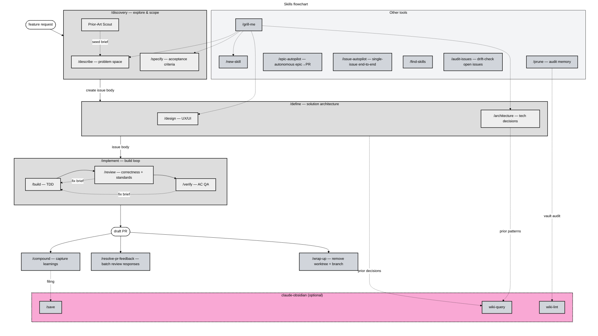

# claude-workflow

Workflow skills plugin for Claude Code — a standardized lifecycle for feature development.



**Legend**: phase orchestrators (gray subgraphs) spawn specialists (light nodes) that do the bounded work. Plugin-level tools run outside the phase lifecycle. The claude-obsidian subgraph shows integrations that activate only when installed.

## Install

```bash
claude plugin marketplace add misiekhardcore/claude-workflow
claude plugin install claude-workflow@claude-workflow
```

Then enable it in your project or globally in Claude Code settings.

## Skills

|Skill|Description|
|-|-|
|`/discovery`|Explore a problem and produce a GitHub issue with acceptance criteria|
|`/define`|Plan architecture and design; produces the implementation handoff|
|`/implement`|Full build→review→verify cycle, ends with a draft PR|
|`/epic-autopilot`|Autonomous epic→PR pipeline; chains `/discovery → /define → /implement` per sub-issue|
|`/issue-autopilot`|Single-issue end-to-end pipeline: `/define` → `/implement` → `/resolve-pr-feedback` → `/compound` → `/wrap-up`|
|`/build`|Code against an issue's acceptance criteria using TDD|
|`/review`|Review an implementation or external PR; correctness, standards, and conditional specialists|
|`/verify`|QA verification of every acceptance criterion|
|`/describe`|Explore and understand a problem space interactively|
|`/specify`|Turn a problem statement into testable acceptance criteria|
|`/architecture`|Decide on technical architecture — components, data flow, trade-offs|
|`/design`|Visual and UX design decisions — layouts, interaction flows|
|`/grill-me`|Relentless interviewing to stress-test a plan or design|
|`/compound`|Capture learnings as structured wiki notes|
|`/wrap-up`|Post-PR cleanup: remove feature worktree, delete branch, clear NOTES.md|
|`/prune`|Audit CLAUDE.md, SKILL.md, and memory for staleness|
|`/audit-issues`|Drift-check open GitHub issues against the current repo state|
|`/find-skills`|Discover and install skills from the ecosystem|
|`/resolve-pr-feedback`|Process PR review feedback in bulk|
|`/new-skill`|Scaffold a new skill conforming to this authoring standard|

## Optional: claude-obsidian integration

When installed and bootstrapped, several skills light up vault-aware paths:

- `/compound` files captures via `/save` instead of reporting inline.
- `/prune` delegates vault audit to `wiki-lint`.
- `/architecture` and `/define` query the vault for prior patterns/decisions.

Without `claude-obsidian`, every skill still runs; vault operations are skipped with a note, and `/compound` emits a structured Markdown block for manual capture. No hard dependency.

## Workflow paths

|Task size|Path|
|-|-|
|Trivial fix|`/implement` directly|
|Medium feature|`/discovery` → `/implement`|
|Large feature / epic|`/discovery` → `/define` → `/implement`|

Full lifecycle walkthrough: [`docs/workflow.md`](docs/workflow.md)

## Token budgets and CLAUDE.md placement

Per-artifact and per-phase token budgets, context-rot threshold, CLAUDE.md placement, and `@`-import syntax: [`docs/token-budgets.md`](docs/token-budgets.md). Context-hygiene rationale: [`docs/context-hygiene.md`](docs/context-hygiene.md).

## Ecosystem

Multi-plugin coordination: MCP scope, inter-plugin dependencies, optional `claude-obsidian` integration via runtime detection: [`docs/cross-plugin.md`](docs/cross-plugin.md).

## Authoring standard

- **Templates**: role-specific skeletons in `_templates/`
- **Convention doc**: `_templates/AUTHORING.md` — skill types, frontmatter, `_shared/` references
- **Scaffolder**: `/new-skill` — interactive generator

Shared protocols at `_shared/`:

|File|Purpose|
|-|-|
|`compaction-protocol.md`|Context editing → delegation → /compact order|
|`composition.md`|Multi-skill composition patterns and contracts|
|`handoff-artifact.md`|Five-field GitHub issue handoff protocol; per-skill section headings defined in each producing skill|
|`interviewing-rules.md`|One-question-at-a-time interview protocol|
|`notes-md-protocol.md`|In-phase NOTES.md memory layer|
|`orchestrator-rules.md`|Shared rules for pipeline orchestrators: CWD verification, delegation, no-autonomous-merge, seed-brief contract|
|`seed-brief.md`|Spawn-time context packaging (YAML-in-XML) for orchestrator→specialist handoff; payload types defined in `specialist-mode`|

## Releasing

Versions in `.claude-plugin/plugin.json` and `.claude-plugin/marketplace.json` (both `metadata.version` and `plugins[0].version`) must agree. Trigger the **Release** workflow via `workflow_dispatch` to bump all three in lockstep, commit, tag, and publish.

Per-release notes with full diffs: [GitHub Releases](https://github.com/misiekhardcore/claude-workflow/releases). In-repo summary: [`CHANGELOG.md`](CHANGELOG.md).

## License

[PolyForm Noncommercial License 1.0.0](LICENSE) — free for personal and open-source use; commercial use requires a separate agreement.
